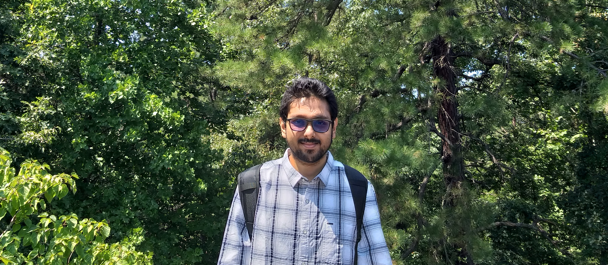

Home | Research | Teaching | Outreach | CV | Bio | Contact
--- | --- | --- | --- | --- | --- | ---

_______

## Hello, I am Kaustav Mitra.
### I am a PhD student in the department of Astronomy at Yale University.

My research with <a href="https://campuspress.yale.edu/vdbosch/" target="_blank">Prof. Frank C. van den Bosch</a> is in the confluence of studying equilibrium dynamics, empirically constraining galaxy formation theories, and inferring cosmological parameters from the large-scale structure of the universe.  We developed <b>Basilisk</b>, a Bayesian hierarchical likelihood inference tool that maximally extracts information from the smallest and most non-linear scales in a galaxy redshift survey.  It forward-models the kinematics and abundance of satellite galaxies around their respective centrals, to infer the statistical link between galaxies and their host dark matter haloes with unprecedented precision.  We combine it with more conventional observables of galaxy populations to break degeneracies and simulataneously constrain cosmological parameters along with the galaxy-halo connection.

[//]: # (This may be the most platform independent comment)  
[//]: # (This may be the most platform independent comment) use this to create equations: https://editor.codecogs.com

## Other Pages:
- Research
- Teaching
- Outreach
- CV
- Bio
- Contact
